# Foami Platform 2.0 — Technical Blueprint

> **Decisions confirmed:**
> - Platform Fee: **20%** (configurable via `app_settings`)
> - Auth: Email + Password (shop owners & platform admin)
> - Payment: Stripe Connect (Destination Charges) — funds held in Platform wallet, shops request withdrawal
> - Domain: ใช้ `foami-wash-and-delivery.vercel.app` ไปก่อน + Custom domain ทีหลัง

---

## 1. Tech Stack

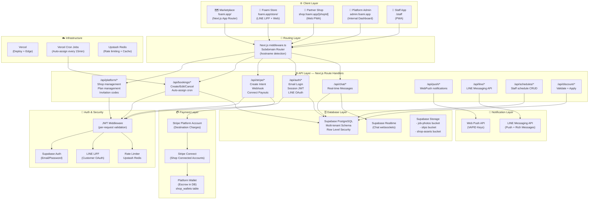

---

## 2. Database ERD — Full Multi-Tenant Schema

### 2.1 Platform Level Tables

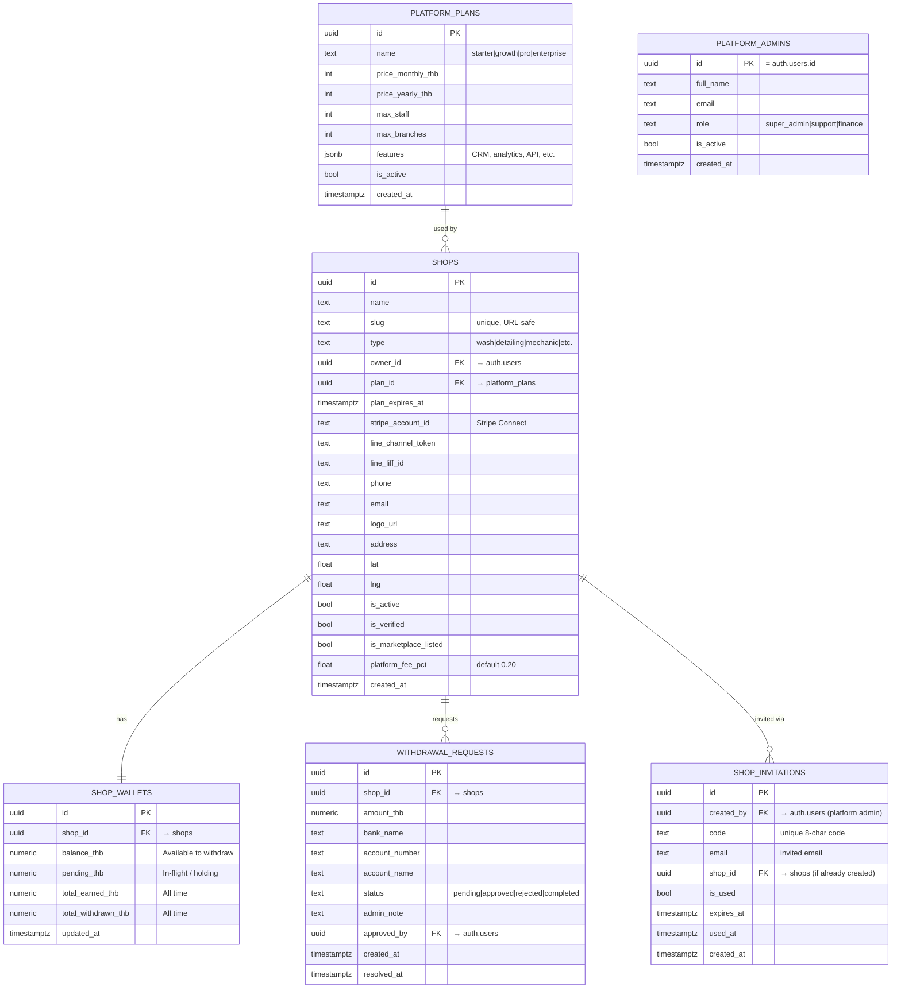

### 2.2 Shop Level Tables (each scoped by shop_id)

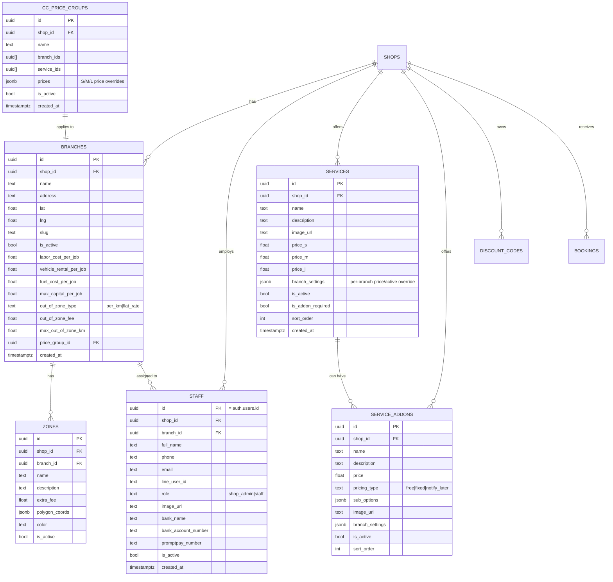

### 2.3 Customer & Booking Tables

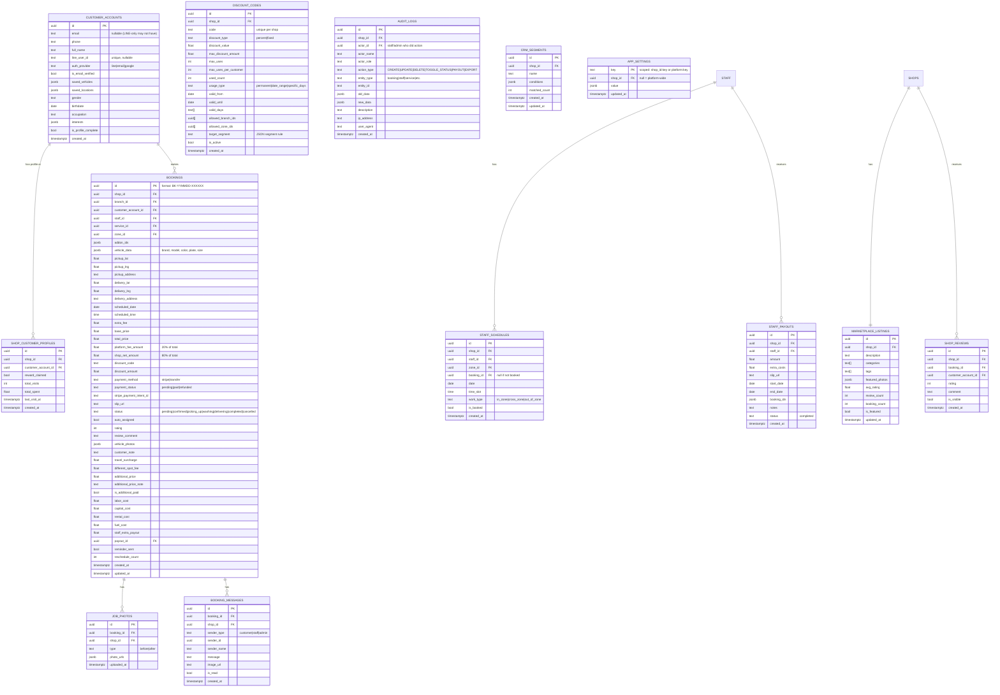

### 2.4 Payment / Wallet Flow Tables

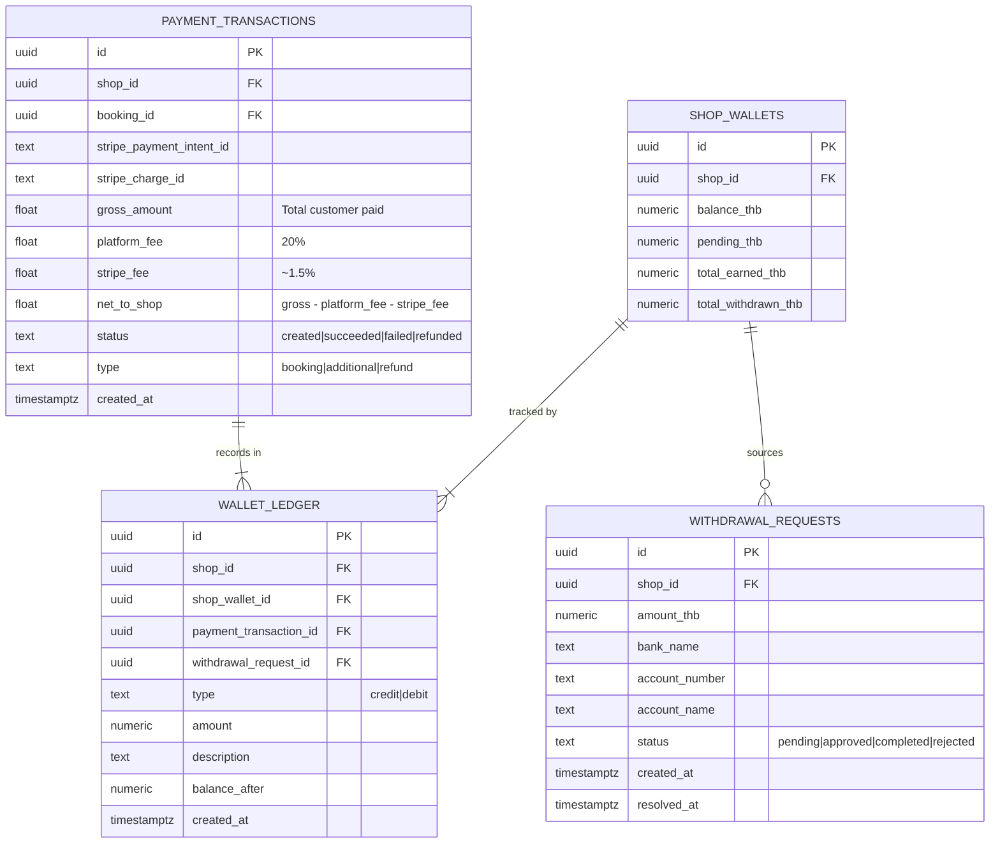

---

## 3. Workflow Diagrams

### 3.1 Customer Booking Flow (Marketplace → Partner Shop)

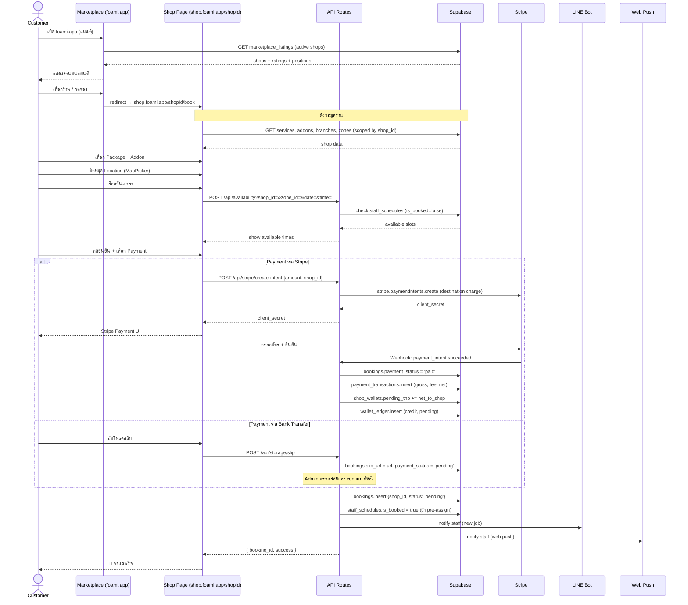

### 3.2 Partner Shop Onboarding Flow

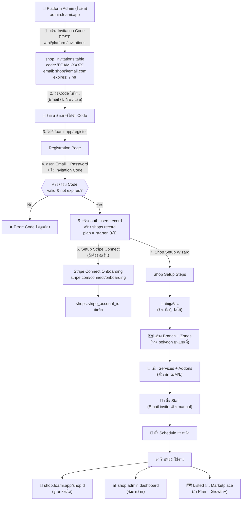

### 3.3 Payment Settlement Flow (Platform Wallet Model)

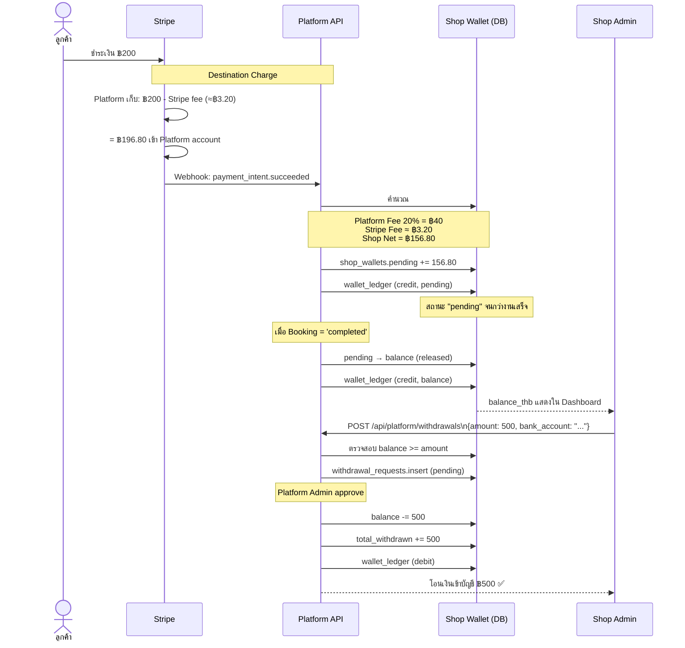

### 3.4 Staff Job Workflow

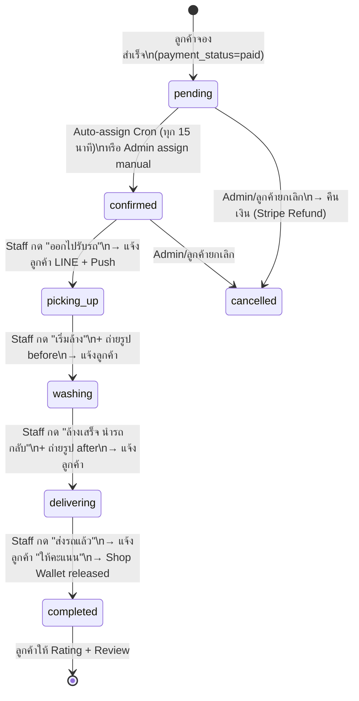

### 3.5 Platform Admin Workflow

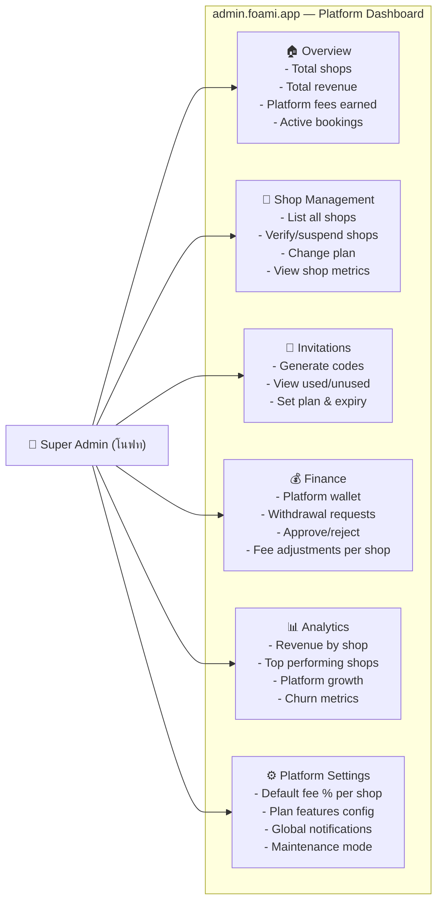

### 3.6 Marketplace Discovery Flow

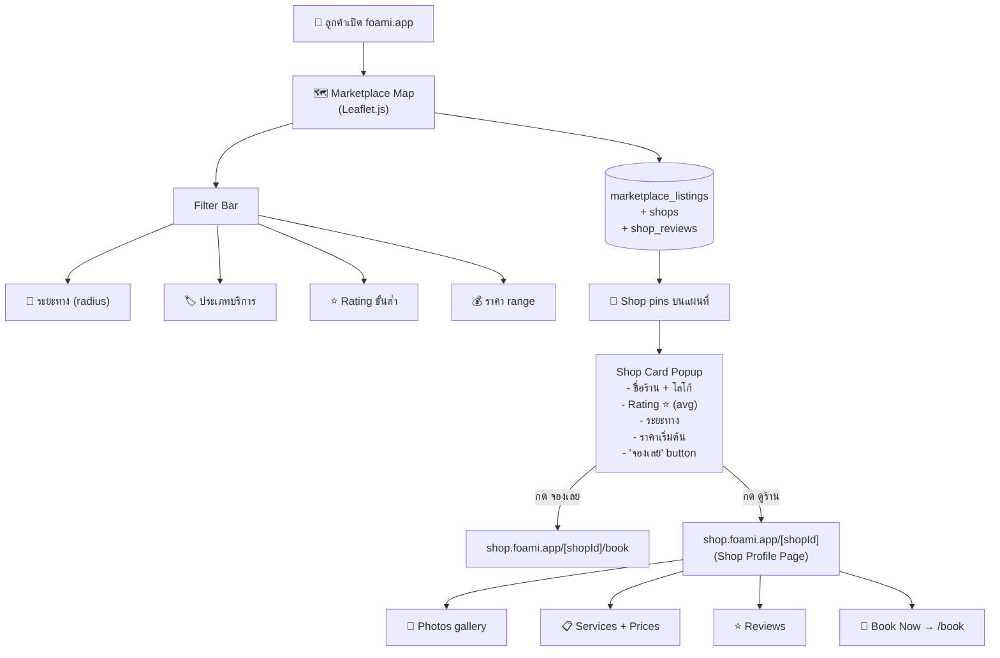

---

## 4. API Route Map (Complete)

| Method | Route | Auth Required | Description |
|---|---|---|---|
| POST | `/api/auth/login` | None | Email + Password login (returns JWT) |
| POST | `/api/auth/line` | None | LINE OAuth callback |
| POST | `/api/auth/logout` | JWT | Logout |
| GET | `/api/platform/shops` | Platform Admin | List all shops |
| POST | `/api/platform/shops` | Platform Admin | Create shop |
| PATCH | `/api/platform/shops/[id]` | Platform Admin | Update shop (plan, status) |
| POST | `/api/platform/invitations` | Platform Admin | Generate invitation code |
| GET | `/api/platform/invitations` | Platform Admin | List invitations |
| GET | `/api/platform/withdrawals` | Platform Admin | Pending withdrawal requests |
| PATCH | `/api/platform/withdrawals/[id]` | Platform Admin | Approve/Reject withdrawal |
| GET | `/api/marketplace/shops` | None | Public: list marketplace shops |
| GET | `/api/marketplace/shops/[slug]` | None | Public: shop profile |
| POST | `/api/bookings` | Customer JWT | Create booking |
| GET | `/api/bookings` | Shop JWT | List bookings (scoped by shop_id) |
| PATCH | `/api/bookings/[id]` | Shop JWT | Update booking status |
| PUT | `/api/bookings/manual/edit` | Shop JWT | Admin edit booking |
| POST | `/api/stripe/create-intent` | Customer JWT | Create Stripe payment intent |
| POST | `/api/stripe/webhook` | Stripe Sig | Handle payment events |
| POST | `/api/stripe/refund` | Shop Admin JWT | Refund payment |
| GET | `/api/availability` | Customer JWT | Check staff availability |
| GET | `/api/schedules` | Shop JWT | Get staff schedules |
| POST | `/api/schedules` | Shop JWT | Create schedule slots |
| DELETE | `/api/schedules/[id]` | Shop JWT | Delete schedule |
| POST | `/api/discount/validate` | None (rate limited) | Validate discount code |
| GET | `/api/chat` | JWT | Get messages for booking |
| POST | `/api/chat` | JWT | Send message |
| POST | `/api/payouts` | Shop Admin JWT | Record staff payout |
| POST | `/api/push/subscribe` | JWT | Register push subscription |
| GET | `/api/cron/auto-assign` | Cron Secret | Auto-assign staff (every 15min) |
| GET | `/api/cron/reminders` | Cron Secret | Send job reminders |

---

## 5. Security Architecture

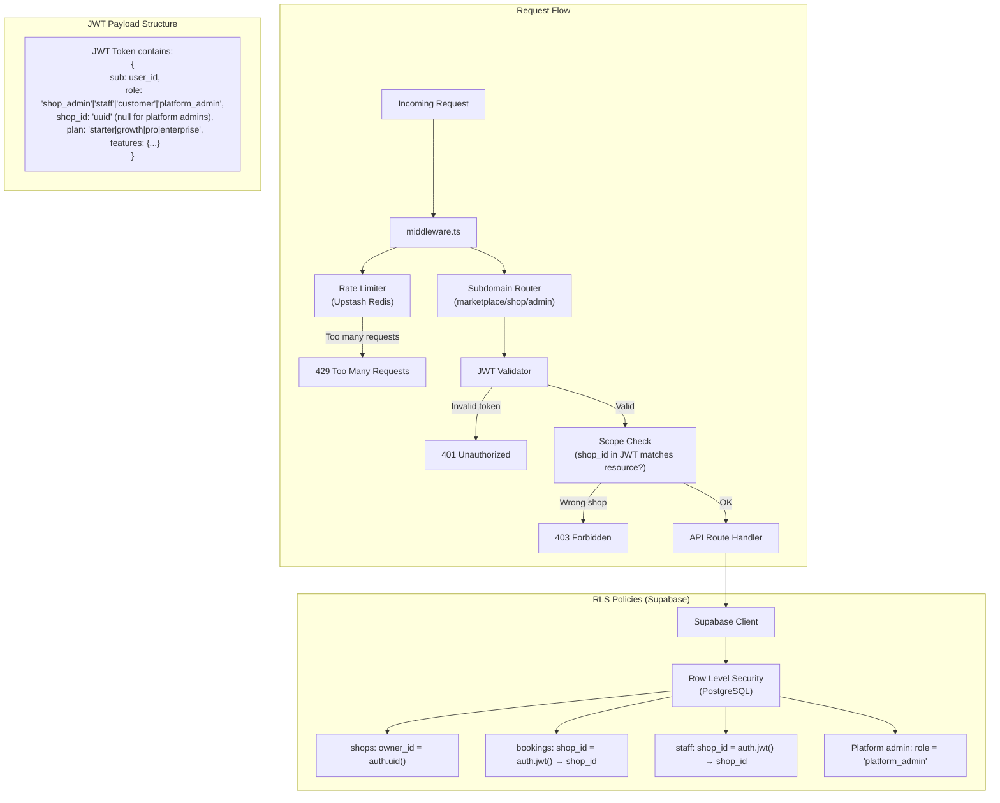

---

## 6. Plan Feature Gating (Code-level)

```typescript
// lib/plan-gates.ts
export const PLAN_FEATURES = {
  starter:    { crm: false,    rfm: false,    push: false,   line_notify: false,  audit: false,  api: false },
  growth:     { crm: true,     rfm: false,    push: true,    line_notify: true,   audit: false,  api: false },
  pro:        { crm: true,     rfm: true,     push: true,    line_notify: true,   audit: true,   api: false },
  enterprise: { crm: true,     rfm: true,     push: true,    line_notify: true,   audit: true,   api: true  },
}

// Usage in API route:
export async function GET(req: NextRequest) {
  const session = await getSession(req)
  if (!hasFeature(session.plan, 'rfm')) {
    return NextResponse.json({ error: 'Feature requires Pro plan' }, { status: 403 })
  }
  // ... rest of handler
}
```

---

## 7. Environment Variables Required

```env
# Supabase
NEXT_PUBLIC_SUPABASE_URL=
NEXT_PUBLIC_SUPABASE_ANON_KEY=
SUPABASE_SERVICE_ROLE_KEY=

# Auth
JWT_SECRET=                        # 256-bit secret for signing tokens
NEXTAUTH_SECRET=

# Stripe
NEXT_PUBLIC_STRIPE_PUBLISHABLE_KEY=
STRIPE_SECRET_KEY=
STRIPE_WEBHOOK_SECRET=

# LINE
LINE_CHANNEL_ACCESS_TOKEN=
LINE_CHANNEL_SECRET=
NEXT_PUBLIC_LINE_LIFF_ID=

# Platform
NEXT_PUBLIC_APP_URL=               # https://foami-wash-and-delivery.vercel.app
NEXT_PUBLIC_PLATFORM_FEE=0.20      # 20% (configurable)
CRON_SECRET=                       # Random 32-char string (NO hardcoded fallback!)

# Upstash Redis (Rate limiting)
UPSTASH_REDIS_REST_URL=
UPSTASH_REDIS_REST_TOKEN=

# Web Push
NEXT_PUBLIC_VAPID_PUBLIC_KEY=
VAPID_PRIVATE_KEY=
```
